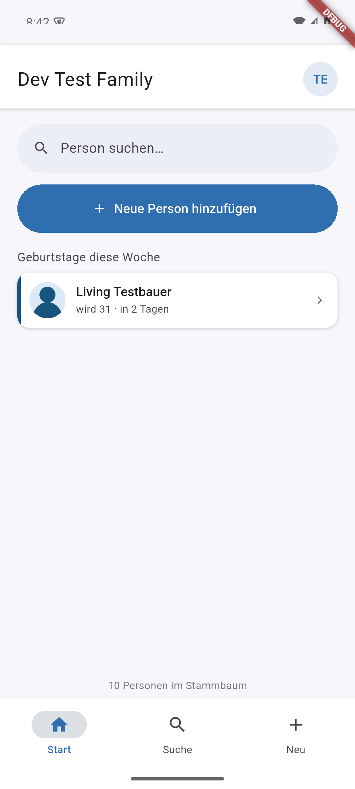
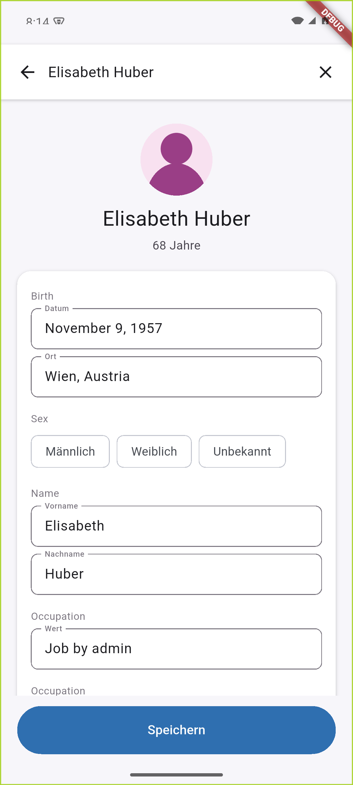

# Stammbaum App

Flutter-Begleit-App (Android/iOS) für die selbst gehostete [webtrees](https://webtrees.net)-Instanz der Familie Scharf. Die App spricht über das Custom-Modul `webtreesand-api` mit dem Server — es gibt keine eigene Backend-API.

## Funktionen

### Start
Startperson, Suche und "Neue Person hinzufügen" auf einen Blick. Darunter, falls zutreffend, **"Geburtstage diese Woche"** — lebende Personen mit Geburtstag in den nächsten 7 Tagen, mit Alter und Countdown ("wird 31 · in 2 Tagen"). Verstorbene werden nie angezeigt. Bottom-Navigation: **Start / Suche / Neu**.

### Suche
Personensuche mit Live-Ergebnissen. Jede Zeile zeigt:
- Foto oder Silhouette, nach Geschlecht eingefärbt
- einen farbigen Balken am linken Rand als zusätzliches Geschlechts-Kennzeichen (auch erkennbar, wenn ein Foto hinterlegt ist)
- ein Grabstein-Symbol für verstorbene Personen

### Person — Ansicht
Alle bekannten Fakten zu einer Person, dazu Eltern/Ehepartner/Kinder als verlinkte Karten. Reihenfolge und Sichtbarkeit der Felder:

- **Immer sichtbar:** Geburt, Tod, Geschlecht
- **Unter "Mehr anzeigen":** Titel, Wohnsitz, Datensatz-ID
- **Nicht angezeigt (nur beim Bearbeiten):** Name — steht bereits über dem Foto, eine zweite Anzeige in der Liste wäre redundant
- **Aktuell nicht verfügbar:** "Aktualisiert am" (GEDCOM `CHAN`) — wird vom `webtreesand-api`-Modul serverseitig herausgefiltert (`SKIP_FACTS`) und kann derzeit nicht abgerufen werden

Die Feld-Reihenfolge ist an einer einzigen Stelle im Code dokumentiert und leicht änderbar: `kFactDisplayOrder` in [`lib/screens/search/person_detail_screen.dart`](lib/screens/search/person_detail_screen.dart).

Ab der dritten verschachtelten Person (z. B. Eltern → Groß­eltern → Urgroß­eltern) erscheint unten links ein schwebender Home-Button, damit man nicht mehrfach "Zurück" tippen muss.

### Person — Bearbeiten
Der Stift-Button oben rechts schaltet die Ansicht auf bearbeitbar um (Stift wird zu X zum Abbrechen). Alle vorhandenen Fakten sind editierbar, auch die sonst unter "Mehr anzeigen" versteckten. Ein Ort-Feld (z. B. Wohnsitz) bietet Autovervollständigung aus den vorhandenen Orten des Stammbaums. Unten ein fixierter **Speichern**-Button.

Der schwebende **Fakt hinzufügen**-Button (unten rechts) bleibt für neue Fakten separat erhalten und wird nur im Ansichtsmodus angezeigt.

Änderungen von Rollen ohne Auto-Freigabe landen wie gewohnt in der webtrees-Moderationswarteschlange.

### Neue Person / Fakt hinzufügen
Formular mit Vorname/Nachname, Geschlecht, Geburtsdatum/-ort (mit Orts-Autovervollständigung), Verknüpfung zu einer bestehenden Person sowie beliebig vielen "weiteren Angaben" (Beruf, Konfession, Wohnort, Notiz, …) — auch Wohnort nutzt die Orts-Autovervollständigung.

### Offline-Fallback
Ist der Server beim schnellen Fakt-Erfassen nicht erreichbar, wird der Eintrag lokal als Notiz gespeichert und kann später synchronisiert werden.

## Design

Das komplette UI-Design (alle Screens, bearbeitbar) liegt als Claude-Design-Canvas vor: **"Stammbaum App Screens"**. Es spiegelt jeweils den aktuellen Stand der App wider und wird bei größeren UI-Änderungen aktualisiert.

## Entwicklung

- State-Management: Riverpod
- Netzwerk: `dio`, eigenes Cookie-Handling (siehe Kommentar in [`lib/api/webtrees_client.dart`](lib/api/webtrees_client.dart))
- Lokaler Speicher: `sqflite` (Offline-Notizen)
- Ziel-Server: Produktion `stammbaum.familiescharf.at` (Standard) oder eine lokale Dev-Instanz (`lib/state/app_providers.dart`)

### Bekannte Lücken (noch nicht umgesetzt)
- Mehrsprachigkeit (Deutsch/Englisch)
- "Mein Konto"-Profilseite mit verknüpftem Personendatensatz

### Hinweis zum Server
"Geburtstage diese Woche" nutzt den bestehenden `Anniversaries`-Endpunkt des `webtreesand-api`-Moduls. Dessen Julian-Day-Berechnung (`->julianDay()` auf `CarbonImmutable`, nie eine echte Carbon-Methode) führte serverseitig zu einem 500-Fehler — behoben in `modules_v4/webtreesand-api/WebtreesAndApiModule.php` (nutzt jetzt `Fisharebest\ExtCalendar\GregorianCalendar`, wie an anderer Stelle in webtrees selbst). **Dieser Fix muss auch auf die Produktion übertragen werden**, sonst bleibt "Geburtstage diese Woche" dort mit einem Serverfehler stehen.
