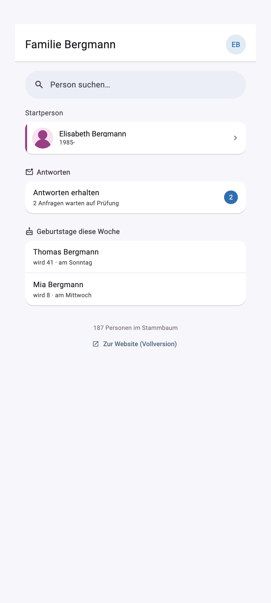
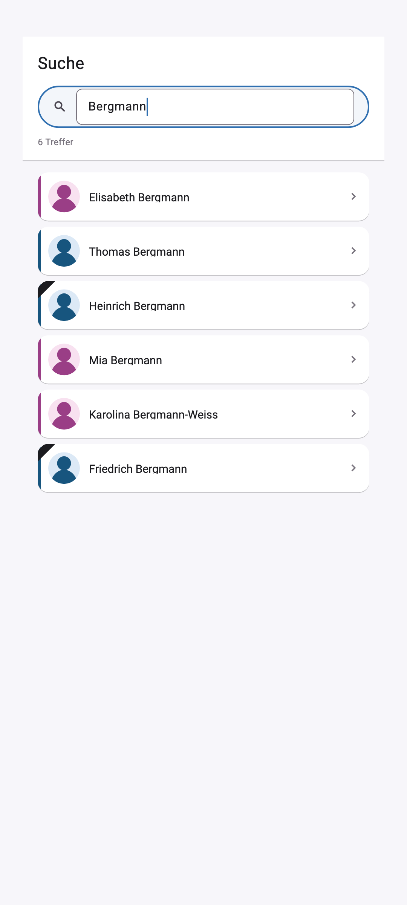
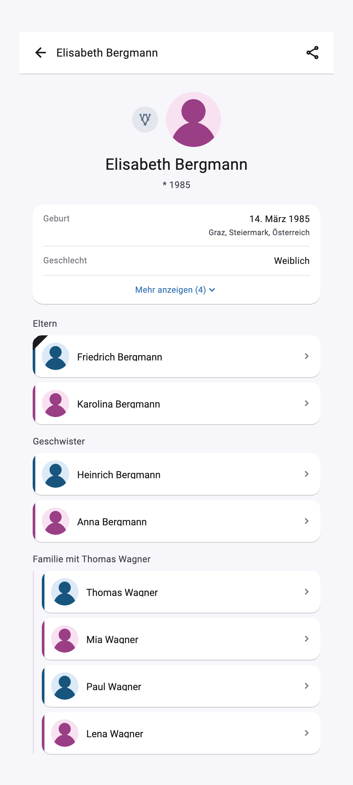
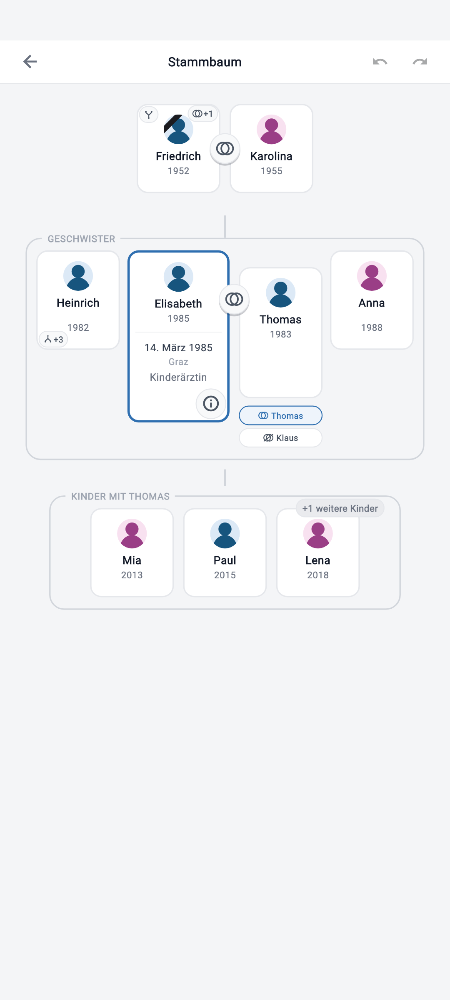
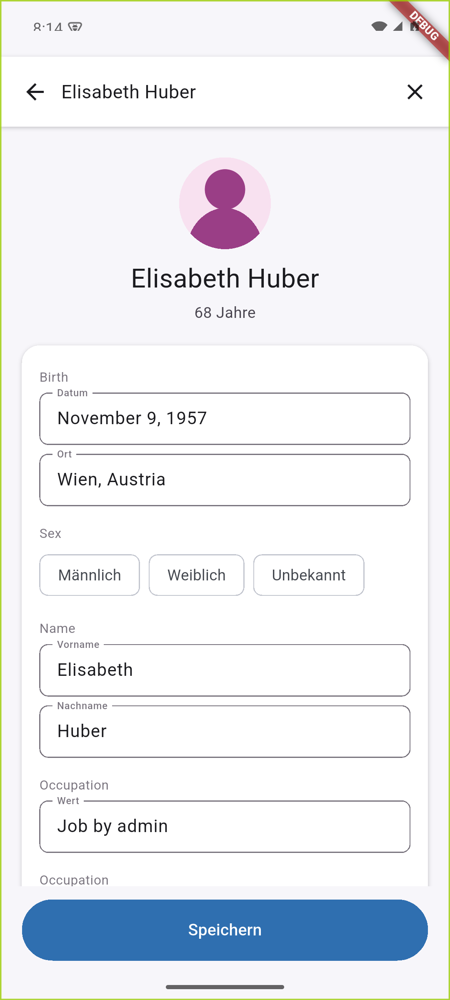
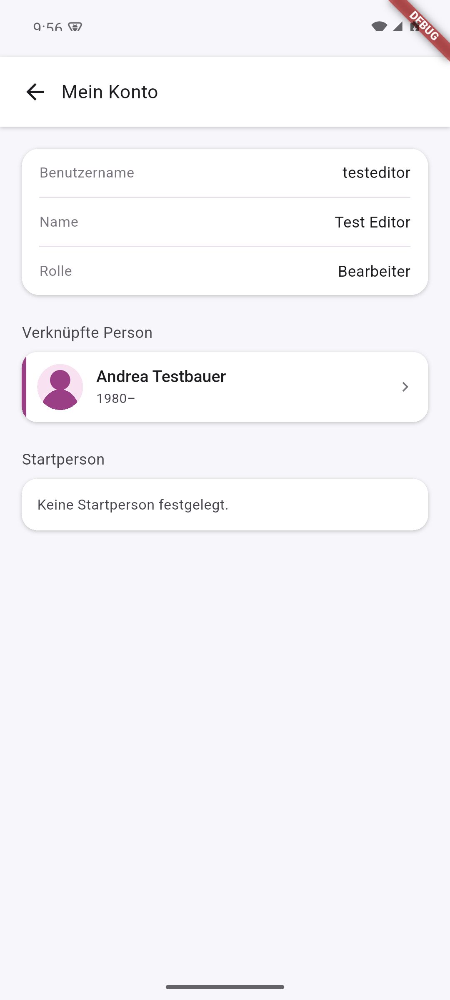

# webtrees-mobile

Flutter app (Android/iOS) for [webtrees](https://webtrees.net) sites. The app talks to the server through the [api4webtrees](https://github.com/thobgg/api4webtrees) module — there is no separate backend API.

## Server requirements

| | Minimum version |
|---|---|
| webtrees | 2.2 |
| api4webtrees – app works | **1.13.0** (API level 24, `Info.trees[].startXref`) |
| api4webtrees – app appears on the "App" page (connect via link/QR code) | first release including [PR #7](https://github.com/thobgg/api4webtrees/pull/7) (not yet released) |
| In-app registration, welcome text/registration settings | currently only in the fork [Schoaf/webtreesand-api](https://github.com/Schoaf/webtreesand-api) (`Register`, `Info.loginForm`) |

Older module versions are not supported.

## Features

### Home
Start person and search at a glance (new individuals are added via the "New" tab at the bottom — there is no separate button on the home screen any more). Below, if applicable, a **"Birthdays this week"** block (with a cake icon) — living individuals with a birthday in the next 7 days, as a plain list (name, with "turns 31 · on Sunday" in small text below), no photo, no card look like the search results. Rows stay tappable. Deceased individuals are never shown. At the end of the scrollable area a **"Full website"** link opens the full website in the external browser. Bottom navigation: **Home / Search / New**.

Top right: initials or photo of the individual linked to the account — tappable, opens **"My account"**.

### Search
Live search for individuals. Each row shows:
- photo or silhouette, tinted by sex
- a coloured bar along the left edge as an additional sex indicator (visible even when there is a photo)
- a diagonal ribbon across the top-left corner for deceased individuals (replaces the former gravestone icon — same design as the family tree view)
- below: the **full date of birth** for living individuals (no dash); "year–year" only for deceased individuals. Applies wherever this row appears (search, parents/spouses/children, My account).

### Individual — view
All known facts about an individual, plus parents/spouses/children as linked cards. Order and visibility of the fields:

- **Always visible:** birth, death, sex
- **Under "Show more":** title, residence, record ID
- **Not shown (only when editing):** name — already shown above the photo, a second display in the list would be redundant
- **Currently not available:** "Last change" (GEDCOM `CHAN`) — filtered out server-side by the API module (`SKIP_FACTS`) and cannot be retrieved at the moment

The field order is documented in a single place in the code and easy to change: `kFactDisplayOrder` in [`lib/screens/search/person_detail_screen.dart`](lib/screens/search/person_detail_screen.dart).

Fields combining several details (e.g. birth/death with date **and** place) show the main detail at normal size and the secondary one in small text below — the same pattern as under the name in the individual cards. Every field can be tapped to copy its value to the clipboard — Android shows its own short system notice for that, so the app no longer shows one (the two used to overlap).

Top left, next to "Edit": a **Share** button. "Share data" opens the system share dialog with a text summary of all the individual's facts (without internal fields such as the record ID). "Share link" shares the individual's normal webtrees page as a link — not a time-limited, login-free share link (that would be a larger feature of its own from the original project plan, not built yet); whoever opens the link needs their own webtrees account, just as when visiting the website directly. If the app is installed, the link opens the individual's detail page in the app instead of the browser (Android App Links via `stammbaum.familiescharf.at`; iOS Universal Links are not set up yet, see [#3](https://github.com/Schoaf/webtrees-mobile/issues/3)).

From the third nested individual onwards (e.g. parents → grandparents → great-grandparents) a floating Home button appears at the bottom left, so you don't have to tap "Back" several times. Floating buttons (Home, Add fact) appear immediately, without a fly-in animation.

### Family tree view
The round tree button to the left of the photo on the individual's detail page opens a separate, freely draggable view (pan, no scrollbars): parents, full siblings, all partners and their children around a "current individual". Display only — the only action is tapping a card, which makes that individual the new current one and rebuilds the whole view around them (no expanding of single cards). The i button at the bottom right of the current individual jumps to the normal (editable) detail page.

Header: the back arrow leaves the view, undo/redo on the right navigate like a browser history through the tapped individuals (a new tap after undo discards the redo entries). Individuals already visited are cached — undo/redo doesn't reload.

Cards show first name, year of birth, photo/silhouette (ribbon for deceased individuals) and status corners: ancestors icon (only for parents/partners — shows whether this individual has known parents), descendants icon with number of children (only for siblings/children), partner rings (only for parents, if they have further partnerships that aren't shown). If a parent has children from other relationships, a small "+N" hint hangs below. If the current individual has several partners, chips to switch between them appear below — swapping partner card, relationship symbol and the children frame to the selected family.

**Known gap:** the partner's first-name line under sibling cards (the design shows it when a sibling has a partner) currently stays empty — the server doesn't deliver the data needed for sibling entries yet.

### Individual — edit
The pencil button at the top right switches the view to editable (the pencil becomes an X for cancelling). All existing facts are editable, including those otherwise hidden under "Show more". A place field (e.g. residence) offers autocompletion from the places already in the tree. A fixed **Save** button sits at the bottom.

In edit mode the photo gets a small camera icon; tapping it opens upload/camera directly to change it, instead of just showing the photo (if there is one) — exactly like adding a photo for the first time.

The floating **Add fact** button (bottom right) remains separate for new facts and is only shown in view mode.

Changes by roles without auto-accept end up in the webtrees moderation queue as usual.

### New individual / add fact
Form with first name/surname, sex, date/place of birth (with place autocompletion), link to an existing individual and any number of "further details" (occupation, religion, residence, note, …) — residence also uses place autocompletion.

### Offline fallback
If the server can't be reached while quickly recording a fact, the entry is stored locally as a note and can be synchronised later.

### My account
A page of its own (not the same as an individual's detail page): username, name and role of the webtrees account, plus the **linked individual** and the tree's **start person**, each as a tappable card leading to that individual's detail page. Reached via the circle at the top right of the home screen.

The pencil at the top right switches to editing: **name** becomes a text field, the **start person** can be chosen anew via "Change start person" using the individual search, with a fixed Save button at the bottom. Username and role are deliberately read-only (the role is set server-side), and so is the **linked individual** — changing the link is an admin function in webtrees itself (user administration), not self-service, and the app respects that boundary. Every field can be tapped to copy it.

At the bottom a **Sign out** button — signs out immediately and goes straight to the sign-in screen (not only on the next navigation). If the device supports biometrics, a **"Lock with biometrics"** switch sits right below (see "Biometric lock" below). Below that a **"Full website"** link to the full website.

### Sign in
A sign-in screen of its own, matching the app (previously an unformatted default screen with English text — it looked like a placeholder, but had always been the real screen running against production). Error messages are understandable instead of a raw exception: wrong password, server not reachable (connection problem) and a general fallback are distinguished.

The app logo at the top centre, below it (once loaded) the name of the tree. At the bottom a footer with "View family tree" (external browser), "Privacy" (links to the website's privacy policy — there is no separate legal notice yet) and the app version.

### Biometric lock
Optional, can be switched on in "My account" (only visible if the device supports biometrics): it doesn't lock the sign-in itself, but *showing* a session restored automatically from a previous app start — a fresh, manual sign-in with username/password is never additionally biometric-locked. Falls back to the device passcode (PIN/pattern) when biometrics are missing or fail, so a sensor failure can't lock anyone out.

### Responses received
As soon as there is at least one unanswered response to "Ask for help" (`webtrees-share`), the home screen shows a **"Responses received"** card — same look/size as the birthdays block, with a badge for the count. Tapping it opens a native list of its own (`ResponsesListScreen`) of all answered/accepted requests — deliberately a table/list, not a dropdown, for choosing which one to review.

The detail view (`ResponseDetailScreen`) works exactly like the web page: before/after comparison per field, each with its own checkbox (nothing preselected — you actively tick what you want to accept), plus note and photo. The button is labelled **"Accept selected"**. After accepting, the app automatically jumps to the next open response (if any) — exactly like the web page — otherwise back to the list.

The link from the "Response received" email is a normal Universal Link to `stammbaum.familiescharf.at` — if the app is installed and you're signed in, it opens the matching detail view directly instead of the web page (see `shareReviewIdFromLink`, same principle as shared individual links).

A request can also be discarded (swipe the row in the list to the left, or the bin at the top of the detail view) — deletes the request permanently, including any stored photo, after a confirmation dialog. Exactly like the web page (a "Discard" button in list and detail view there) — both use the same server-side endpoint.

### My account (addition)
In non-edit mode, in addition to "Full website": a **"Privacy"** link and the app version, directly below the "Sign out" button.

### Website links in the mobile theme
The **Privacy** link opens the website with `mobile=1`, i.e. in the **theme for mobile devices** from the webtrees website settings. The links to the **full version** ("Full website", "View family tree") open it with `mobile=0`, i.e. in the standard theme, even if webtrees would otherwise detect the phone automatically. Both apply for the rest of the browser session. The shared individual link deliberately stays without the parameter, because the recipient might be on a desktop. The app always opens `index.php?...` for this, because webtrees' redirect from `/` destroys any query. Server-side: Stammbaum commit `e4c205a275`, upstream PR [fisharebest/webtrees#5502](https://github.com/fisharebest/webtrees/pull/5502).

## Design

The complete UI design (all screens, editable) exists as a Claude Design canvas: **"Stammbaum App Screens"**. It reflects the current state of the app and is updated with larger UI changes.

## Development

- State management: Riverpod
- Networking: `dio`, own cookie handling (see the comment in [`lib/api/webtrees_client.dart`](lib/api/webtrees_client.dart))
- Local storage: `sqflite` (offline notes)
- Target server: chosen by the user on first start (address or connect link); a local dev instance is configured in [`lib/state/app_providers.dart`](lib/state/app_providers.dart)

### Server note
"Birthdays this week" uses the existing `Anniversaries` endpoint of the API module. Its Julian day calculation (`->julianDay()` on `CarbonImmutable`, never a real Carbon method) caused a 500 error server-side — fixed in the module (now uses `Fisharebest\ExtCalendar\GregorianCalendar`, the same calendar library webtrees ships itself). Checked: the bug does **not** exist in webtrees core itself — so no pull request needed there, only the third-party module fix. (A first attempt used `TimestampFactory::todayJulianDay()`, which does exist in webtrees core, but only from a newer version than the 2.2.6 running in production — that briefly broke production before switching to the version-independent variant.) Deployed to production and verified.

### Server note: family tree view
`Individual` additionally delivers `siblings[]` and `extraChildrenByParent`, every nested individual in it (parents, partners, children) carries `hasParents`/`partnersCount`/`childrenCount`, and every partner family a `maritalStatus` — all additive, opt-in computed fields (`personSummary(..., $with_counts: true)`), only active for `Individual`. The individual list/search (`Individuals`) stays fast, without the additional database queries per hit. No new endpoint needed — `TreeViewScreen` uses the same `individual()` call the normal individual detail page makes. (Since api4webtrees 1.8.0 the app derives these from the upstream fields — `stepFamilies`, the parent family's children, the family's facts; the fork still sends the old fields for app 1.0.0.)

### Fixed: "Server not reachable" on real Android devices
Every release build simply had **no internet permission** — `android/app/src/main/AndroidManifest.xml` (the `main` manifest used in release builds) was missing `<uses-permission android:name="android.permission.INTERNET"/>` entirely; only the `debug`/`profile` manifest variants generated automatically by Flutter had it, which is why the bug never showed up in the emulator/with `flutter run`. An initial suspicion of a TLS/certificate problem (ISRG Root X2) turned out to be a false lead — confirmed by reproducing the exact release APK on the emulator, where the same error occurred while the emulator's browser loaded the same page without problems. Fixed by adding the missing permission; `network_security_config.xml` (trusting user CA certificates) remained as a harmless side effect, but was never the actual cause.
